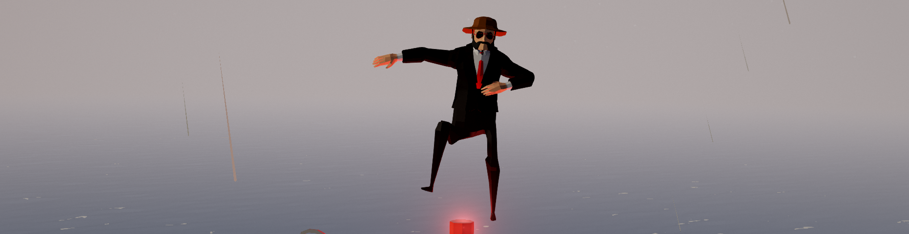

# Stormworks Addon Lua Documentation

    
    

## 📚 Overview
A simple repo containing the Stormworks Addon Lua documentation.

For intellisense (auto-completion, etc) with Visual Studio Code and the Lua extension, `/docs/intellisense.lua` is what you're looking for.

For the modding lua documentation, check out [this repo.](https://github.com/Cuh4/StormworksModLuaDocumentation)

## 👨‍🦱 Credit
- **[Cuh4](https://github.com/Cuh4)** - Maintainer
- **[NameousChangey](https://github.com/nameouschangey)** & **[Toastery](https://github.com/Toast732)** - Original Creators of `/docs/intellisense.lua`